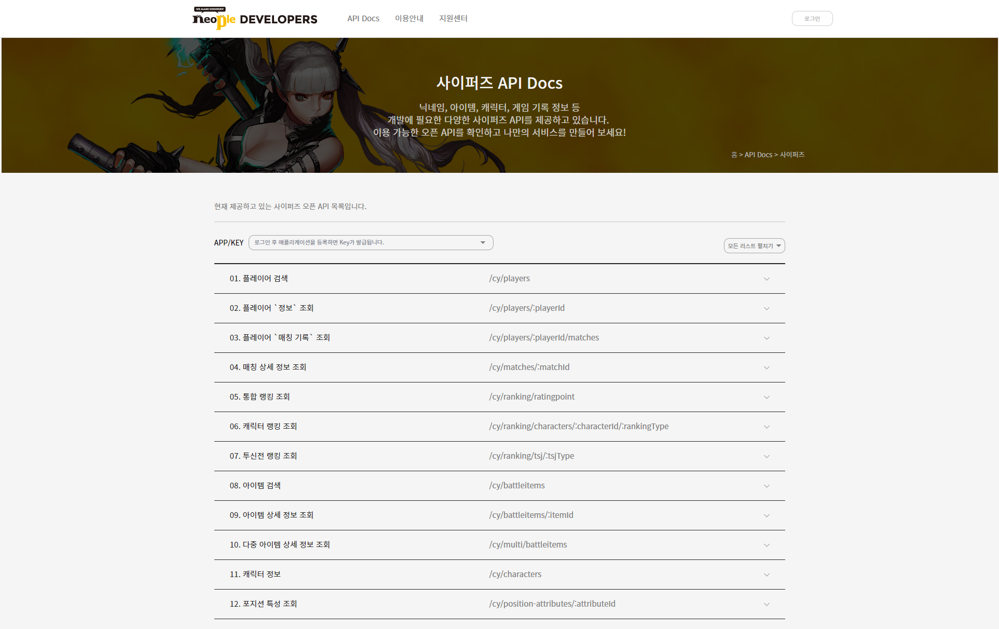

# 사이퍼즈 App 개발기 :rocket:

&nbsp;

요리를 하다가 문득 취미로 앱을 개발을 하기로 하였다.

**2019년 12월 7일 오후 10시** 개발 시작.

뭔가 개발을 할만한 게 없나 고민 끝에 예전에 재미있게 했던 게임 사이퍼즈가 생각이 나서 개발을 시작했다.

일을 시작하면서 실질적으로 하기힘든 게임이 되었지만,

가끔 재밌게 했던 기억이 떠올라 Youtube에서 가끔 보기도 한다. :tv:

그냥 남는 게 없는 것 같아서 이제 기록을 남기고자 한다.

글은 못쓰지만 생각의 흐름대로 그냥 글을 쓰기로 하겠다. 안쓰는 것보단 낫겠다는 생각으로.

어떻게 개발을 할지 고민 끝에 **기획, 프로토타이핑 , 개발 , 앱 배포**까지 혼자서 다 해보기로 했다.

계획은 다음과 같이 하기로 했다.

>&nbsp;
> **기획** :cd:: Powerpoint  
> **프로토타이핑** :movie_camera: : WebFlow  
> **개발** :video_game:: React Native  
> **앱 배포** :iphone: : Android  
>&nbsp;

&nbsp;
&nbsp;

## 사이퍼즈 앱 개발 기획 (**2019.12.07**) :calendar:

&nbsp;

개발 기획은 이렇다.

플레이어 검색이 기본화면이며, 추가적인 조회를 가능하게 할 생각이다.

원래는 디테일 기획을 짤 생각이었으나, 시간 단축을 위해 프로토타이핑을 하며 진행할 생각이다.

물론 프로토타이핑 Tool을 배울 시간도 필요하여 빡세게 진행할 생각이다.

아마 내일 일가면 피곤하겠지..

### **Plan**

### **API 발급**

&nbsp;

## 프로토 타이핑 툴 기술 배우기 :memo:

&nbsp;
WebFlow라는 프로톹타이핑 툴을 사용하기로 결정했고, 하루에서 일주일 정도는 이걸 배우는 데 사용해야 겠다.

&nbsp;
&nbsp;
&nbsp;

[**처음으로 돌아가기**](../readme.md) &#x1F34E;